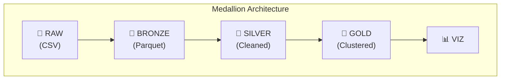
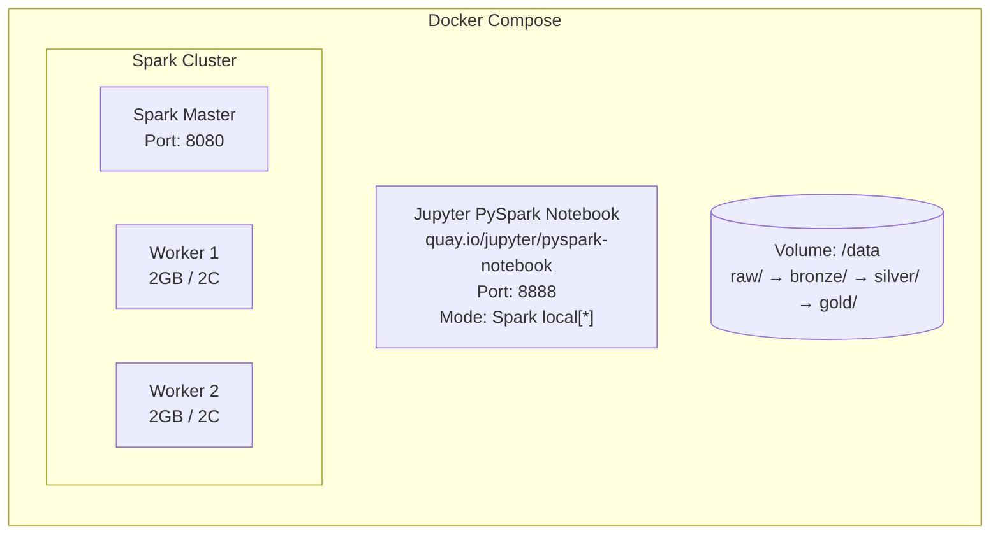
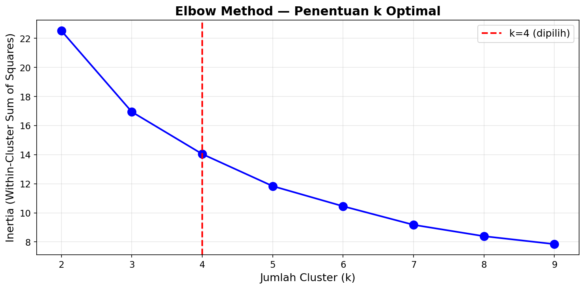
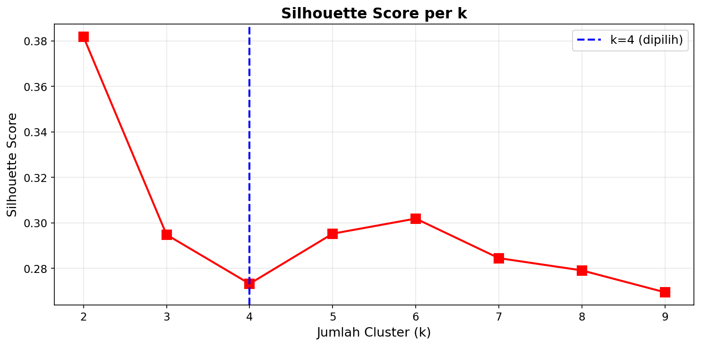
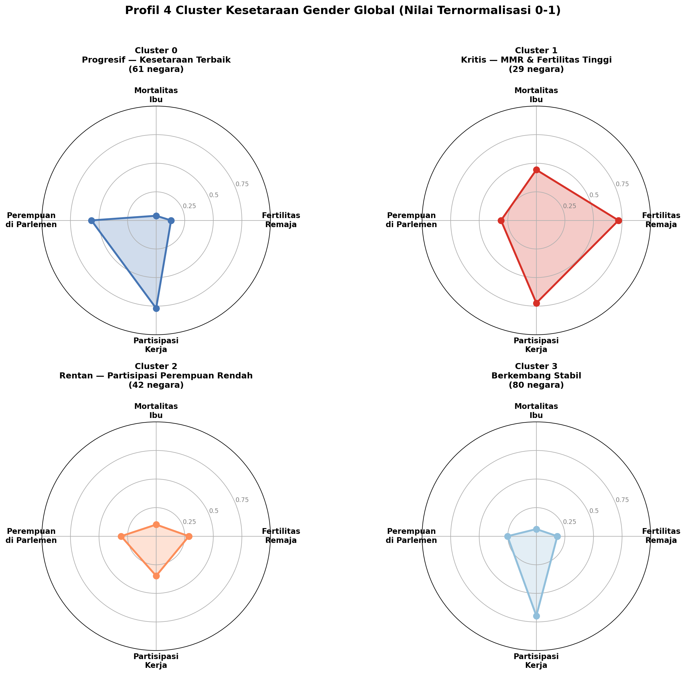
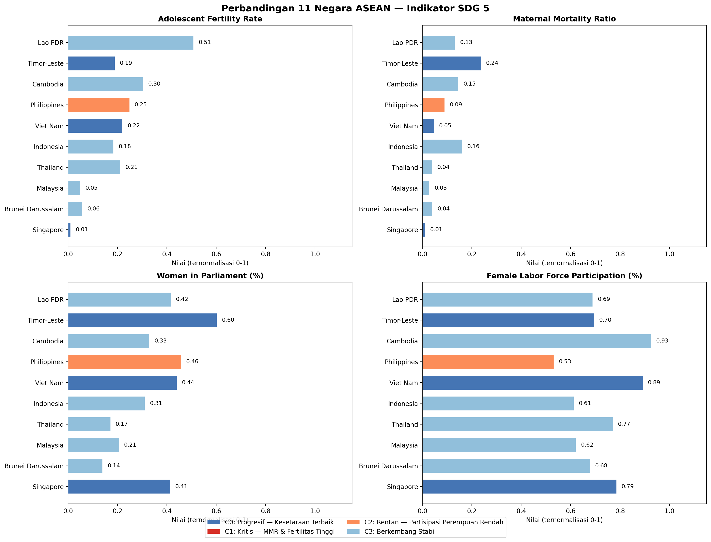

# 🌍 Analisis Kesetaraan Gender Global (SDG 5) dengan K-Means Clustering

> **Tugas Besar Mata Kuliah Big Data**  
> Mengelompokkan 212 negara berdasarkan indikator kesetaraan gender menggunakan Apache Spark dan K-Means Clustering

---

## 📋 Daftar Isi

- [Deskripsi Proyek](#-deskripsi-proyek)
- [Tools & Library](#-tools--library)
- [Variabel Penelitian](#-variabel-penelitian-x--y)
- [Metode yang Digunakan](#-metode-yang-digunakan)
- [Arsitektur Pipeline](#-arsitektur-pipeline-medallion-architecture)
- [Arsitektur Infrastruktur](#-arsitektur-infrastruktur)
- [Dataset](#-dataset)
- [Struktur Proyek](#-struktur-proyek)
- [Hasil dan Output](#-hasil-dan-output)
- [Cara Menjalankan](#-cara-menjalankan)
- [Anggota Kelompok](#-anggota-kelompok)

---

## 📖 Deskripsi Proyek

Proyek ini menganalisis **kesetaraan gender di 212 negara** menggunakan data dari World Bank Gender Statistics. Dengan pendekatan **unsupervised learning (K-Means Clustering)**, negara-negara dikelompokkan berdasarkan 4 indikator **Sustainable Development Goal 5 (SDG 5)** — Gender Equality.

### 4 Indikator SDG 5

| Kode | Indikator | Deskripsi |
|------|-----------|-----------|
| `SP.ADO.TFRT` | Adolescent Fertility Rate | Tingkat kesuburan remaja (15-19 tahun) per 1.000 perempuan |
| `SH.STA.MMRT` | Maternal Mortality Ratio | Rasio kematian ibu per 100.000 kelahiran hidup |
| `SG.GEN.PARL.ZS` | Women in Parliament (%) | Persentase kursi parlemen yang diduduki perempuan |
| `SL.TLF.ACTI.FE.ZS` | Female Labor Force Participation (%) | Persentase perempuan usia 15+ dalam angkatan kerja |

---

## 🧰 Tools & Library

### Tools / Platform

| Tool | Versi | Fungsi |
|------|-------|--------|
| **Apache Spark (PySpark)** | 3.5.0 | Distributed data processing — membaca CSV, transformasi data, dan menyimpan ke Parquet |
| **Docker & Docker Compose** | Latest | Containerization — menjalankan Spark cluster dan Jupyter dalam container terisolasi |
| **Jupyter Notebook** | Latest | Interactive development environment untuk menjalankan kode Python secara bertahap |
| **Git & GitHub** | Latest | Version control dan kolaborasi kode |

### Library Python

| Library | Fungsi | Digunakan di |
|---------|--------|-------------|
| `pyspark` | Membaca/menulis data besar, transformasi DataFrame, Spark SQL | Bronze, Silver, Gold |
| `pyspark.sql.functions` | Fungsi transformasi kolom (`col`, `avg`, `expr`, `broadcast`) | Silver |
| `pyspark.sql.types` | Definisi schema (`StructType`, `StructField`, `StringType`) | Bronze |
| `pandas` | Manipulasi data tabular setelah konversi dari Spark | Silver, Gold, Viz |
| `numpy` | Operasi numerik dan array | Gold, Viz |
| `scikit-learn` | K-Means Clustering, PCA, dan metrik evaluasi | Gold |
| `sklearn.cluster.KMeans` | Algoritma K-Means untuk clustering | Gold |
| `sklearn.decomposition.PCA` | Principal Component Analysis untuk reduksi dimensi | Gold |
| `sklearn.metrics` | Silhouette Score, Davies-Bouldin Index, Calinski-Harabasz Index | Gold |
| `sklearn.preprocessing.MinMaxScaler` | Normalisasi Min-Max (skala 0-1) | Silver |
| `matplotlib` | Visualisasi statis (Radar Chart, Bar Chart, Elbow, Silhouette) | Gold, Viz |
| `plotly` | Visualisasi interaktif (Choropleth Map, Scatter PCA) | Viz |

---

## 🔢 Variabel Penelitian (X & Y)

### Tipe Pembelajaran: **Unsupervised Learning**

> Karena menggunakan K-Means Clustering (unsupervised), **tidak ada variabel Y (target/label)**. Semua variabel adalah **fitur (X)** yang digunakan untuk mengelompokkan negara.

### Variabel X (Fitur / Input)

4 indikator SDG 5 yang digunakan sebagai fitur clustering:

| # | Variabel (Kode) | Nama Lengkap | Tipe Data Asli | Tipe Setelah Preprocessing | Skala | Rentang Asli |
|---|----------------|--------------|:--------------:|:--------------------------:|:-----:|:------------:|
| X₁ | `SP.ADO.TFRT` | Adolescent Fertility Rate | `String` (CSV) | `Double` → `Float (0-1)` | Rasio | 0.43 – 179.58 |
| X₂ | `SH.STA.MMRT` | Maternal Mortality Ratio | `String` (CSV) | `Double` → `Float (0-1)` | Rasio | 2 – 1,150 |
| X₃ | `SG.GEN.PARL.ZS` | Women in Parliament (%) | `String` (CSV) | `Double` → `Float (0-1)` | Rasio | 0 – 61.3% |
| X₄ | `SL.TLF.ACTI.FE.ZS` | Female Labor Force Participation (%) | `String` (CSV) | `Double` → `Float (0-1)` | Rasio | 5.9 – 86.5% |

### Variabel Y (Output)

| Variabel | Deskripsi | Tipe | Nilai |
|----------|-----------|:----:|:-----:|
| `cluster` | Label cluster hasil K-Means | `Integer` | 0, 1, 2, 3 |
| `cluster_label` | Nama deskriptif cluster | `String` | Progresif, Kritis, Rentan, Berkembang Stabil |

> **Catatan:** `cluster` bukan variabel target yang diprediksi, melainkan **output dari algoritma** K-Means. Ini yang membedakan unsupervised learning dari supervised learning.

### Variabel Metadata (Non-Fitur)

Variabel ini **tidak digunakan dalam clustering**, hanya untuk identifikasi dan analisis lanjutan:

| Variabel | Tipe Data | Deskripsi | Contoh |
|----------|:---------:|-----------|--------|
| `Country Code` | `String` | Kode ISO 3 huruf | IDN, SGP, USA |
| `Country Name` | `String` | Nama negara | Indonesia, Singapore |
| `Region` | `String` | Kawasan geografis (dari World Bank) | East Asia & Pacific |
| `Income Group` | `String` | Klasifikasi pendapatan (World Bank) | Upper middle income |

### Alur Transformasi Tipe Data

```
CSV (String semua)
  → Bronze: String (tanpa perubahan)
    → Silver: String → Double → cast → Min-Max Normalisasi → Float (0-1)
      → Gold: Float (0-1) → K-Means → cluster (Integer)
```

### PCA (Principal Component Analysis)

Untuk keperluan visualisasi 2D, 4 fitur direduksi menjadi 2 komponen utama:

| Komponen | Explained Variance | Loading Utama |
|----------|:-----------------:|---------------|
| **PC1** | 48.7% | Fertilitas (+0.82), MMR (+0.53) |
| **PC2** | 27.3% | LFP (−0.81), Parlemen (−0.55) |
| **Total** | **76.1%** | 76.1% informasi asli dipertahankan |

> PC1 merepresentasikan **"beban kesehatan reproduksi"** (fertilitas + kematian ibu).  
> PC2 merepresentasikan **"partisipasi perempuan"** (parlemen + angkatan kerja).

---

## 🔬 Metode yang Digunakan

### Data Processing
| Tahap | Teknik | Tujuan |
|-------|--------|--------|
| Ingestion | Apache Spark (PySpark) | Membaca CSV 101 MB dan konversi ke Parquet |
| Cleaning | Filter, Broadcast Join | Memilih 4 indikator SDG 5, membuang kawasan agregat |
| Reshaping | Stack/Melt (Wide → Long) | Mengubah kolom tahun menjadi baris |
| Imputasi | Regional Median + Global Median | Mengisi missing values berdasarkan median regional |
| Normalisasi | Min-Max Scaling (0-1) | Menyamakan skala keempat indikator |

### Machine Learning
| Teknik | Tujuan |
|--------|--------|
| **Elbow Method** | Menentukan jumlah cluster optimal |
| **Silhouette Score** | Evaluasi kualitas pemisahan cluster |
| **K-Means Clustering (k=4)** | Mengelompokkan negara ke 4 cluster |
| **PCA (2 Komponen)** | Reduksi dimensi untuk visualisasi 2D |

### Evaluasi
| Metrik | Nilai | Interpretasi |
|--------|-------|-------------|
| Silhouette Score | **0.2732** | Wajar untuk data sosial-demografis yang bersifat kontinum |
| Davies-Bouldin Index | **1.1657** | < 1.5 → cluster cukup kompak dan terpisah |
| Calinski-Harabasz Index | **99.09** | Semakin tinggi → separasi dan densitas memadai |

---

## 🏗️ Arsitektur Pipeline (Medallion Architecture)

Proyek menggunakan **Medallion Architecture** (Bronze → Silver → Gold) yang merupakan best practice dalam data engineering:



| Layer | Notebook | Input | Output | Proses |
|-------|----------|-------|--------|--------|
| **Bronze** | `01_bronze.ipynb` | CSV mentah (101 MB) | Parquet (tanpa transformasi) | Ingest data mentah |
| **Silver** | `02_silver.ipynb` | Bronze Parquet | 212 negara × 8 kolom (normalized) | Filter, cleaning, imputasi, normalisasi |
| **Gold** | `03_gold.ipynb` | Silver Parquet | Clustering result + charts | K-Means, evaluasi, PCA, analisis ASEAN |
| **Viz** | `04_visualizations.ipynb` | Gold CSV | HTML interaktif + PNG | Choropleth, Scatter PCA, Radar, Bar Chart |

---

## 🖥️ Arsitektur Infrastruktur



| Komponen | Image | Fungsi |
|----------|-------|--------|
| **Jupyter** | `quay.io/jupyter/pyspark-notebook:spark-3.5.0` | Menjalankan notebook dengan PySpark |
| **Spark Master** | `apache/spark:3.5.0` | Koordinator cluster Spark |
| **Spark Worker ×2** | `apache/spark:3.5.0` | Executor komputasi (2GB RAM, 2 core) |

> **Catatan:** Notebook menggunakan mode `local[*]` (bukan cluster mode) karena dataset hanya 101 MB. Cluster mode lebih cocok untuk dataset puluhan GB ke atas.

---

## 📊 Dataset

**Sumber:** [World Bank Gender Statistics](https://databank.worldbank.org/source/gender-statistics)

| File | Ukuran | Baris | Kolom | Deskripsi |
|------|--------|:-----:|:-----:|-----------|
| `Gender_StatsCSV.csv` | 101 MB | 368.880 | 70 | Data utama (4 kolom ID + 66 kolom tahun) |
| `Gender_StatsCountry.csv` | 153 KB | 271 | 31 | Metadata negara (Region, Income Group, dll) |
| `Gender_StatsSeries.csv` | 3.1 MB | 3.318 | 20 | Metadata indikator |

### Schema Data Utama (`Gender_StatsCSV.csv`)

| Kolom | Tipe Data | Deskripsi |
|-------|:---------:|-----------|
| `Country Name` | String | Nama negara (e.g., "Indonesia") |
| `Country Code` | String | Kode ISO 3 huruf (e.g., "IDN") |
| `Indicator Name` | String | Nama indikator lengkap |
| `Indicator Code` | String | Kode indikator (e.g., "SP.ADO.TFRT") |
| `1960` – `2025` | String | Nilai indikator per tahun (66 kolom) |

### Schema Metadata Negara (`Gender_StatsCountry.csv`)

| Kolom Utama | Tipe Data | Deskripsi |
|-------------|:---------:|-----------|
| `Country Code` | String | Kode ISO 3 huruf |
| `Short Name` | String | Nama pendek negara |
| `Region` | String | Kawasan (null = kawasan agregat → dibuang) |
| `Income Group` | String | High / Upper Middle / Lower Middle / Low income |

### Ringkasan Data per Layer

| Layer | Jumlah Baris | Jumlah Kolom | Missing Values |
|-------|:------------:|:------------:|:--------------:|
| **Raw** (CSV) | 368.880 | 70 | Banyak (tahun tanpa data) |
| **Bronze** (Parquet) | 368.880 | 70 | Sama (belum dibersihkan) |
| **Silver** (Parquet) | 212 | 8 | **0** (sudah diimputasi) |
| **Gold** (CSV) | 212 | 13 | **0** |

**Periode data yang digunakan:** 2015-2022 (dirata-ratakan per negara)  
**Negara teranalisis:** 212 dari 271 (59 entitas kawasan agregat dibuang, 5 negara tanpa data lengkap)

---

## 📂 Struktur Proyek

```
tubes-bigdata/
├── README.md                       ← Dokumentasi proyek (file ini)
├── docker-compose.yml              ← Konfigurasi Docker
├── .gitignore                      ← File yang tidak di-track Git
│
├── notebooks/                      ← Source code pipeline
│   ├── 01_bronze.ipynb             ← Layer 1: Ingest data mentah
│   ├── 02_silver.ipynb             ← Layer 2: Cleaning & normalisasi
│   ├── 03_gold.ipynb               ← Layer 3: Clustering & evaluasi
│   └── 04_visualizations.ipynb     ← Layer 4: Visualisasi
│
├── data/                           ← Data (tidak di-commit ke GitHub)
│   ├── raw/                        ← Dataset CSV asli
│   ├── bronze/                     ← Output Parquet mentah
│   ├── silver/                     ← Output Parquet bersih
│   └── gold/                       ← Output clustering + visualisasi
│
└── docs/
    └── images/                     ← Gambar untuk README
        ├── elbow_chart.png
        ├── silhouette_chart.png
        ├── radar_chart.png
        └── asean_comparison.png
```

---

## 📈 Hasil dan Output

### Hasil Clustering (K-Means, k=4)

| Cluster | Label | Jumlah | Karakteristik Utama |
|---------|-------|--------|-------------------|
| 0 | 🟦 **Progresif — Kesetaraan Terbaik** | 61 negara | Fertilitas rendah (0.13), MMR rendah (0.04), Parlemen tinggi (0.57), LFP tinggi (0.77) |
| 1 | 🟥 **Kritis — MMR & Fertilitas Tinggi** | 29 negara | Fertilitas sangat tinggi (0.72), MMR tinggi (0.44) |
| 2 | 🟧 **Rentan — Partisipasi Rendah** | 42 negara | LFP sangat rendah (0.35), Parlemen rendah (0.31) |
| 3 | 🟩 **Berkembang Stabil** | 80 negara | Nilai menengah di semua indikator |

### Elbow Method

<p align="center">
  
</p>

Inertia menurun tajam dari k=2 ke k=4, lalu melandai. **k=4 dipilih** sebagai titik siku optimal.

### Silhouette Score

<p align="center">
  
</p>

k=4 memiliki silhouette 0.27, yang wajar untuk data sosial-demografis yang bersifat kontinum.

### Profil 4 Cluster (Radar Chart)

<p align="center">
  
</p>

Radar chart menunjukkan perbedaan profil yang jelas antar cluster. Cluster Progresif unggul di parlemen dan LFP, sementara Cluster Kritis memiliki fertilitas dan MMR tinggi.

### Validasi Eksternal (Cluster vs Income Group)

| Cluster | High Income | Upper Middle | Lower Middle | Low Income |
|---------|:-----------:|:------------:|:------------:|:----------:|
| **0 — Progresif** | **38** | 15 | 5 | 2 |
| **1 — Kritis** | 1 | 1 | 10 | **17** |
| **2 — Rentan** | 4 | 13 | **20** | 4 |
| **3 — Berkembang** | **43** | **24** | 12 | 1 |

> Cluster Progresif didominasi High Income (62%), Cluster Kritis didominasi Low Income (59%). Ini membuktikan cluster bermakna secara ekonomi.

### Analisis ASEAN

<p align="center">
  
</p>

| Negara | Income Group | Cluster |
|--------|:-------------|:--------|
| 🇸🇬 Singapore | High income | 🟦 Progresif |
| 🇻🇳 Vietnam | Lower middle income | 🟦 Progresif |
| 🇹🇱 Timor-Leste | Lower middle income | 🟦 Progresif |
| 🇵🇭 Philippines | Lower middle income | 🟧 Rentan |
| 🇧🇳 Brunei | High income | 🟩 Berkembang Stabil |
| 🇮🇩 Indonesia | Upper middle income | 🟩 Berkembang Stabil |
| 🇲🇾 Malaysia | Upper middle income | 🟩 Berkembang Stabil |
| 🇹🇭 Thailand | Upper middle income | 🟩 Berkembang Stabil |
| 🇰🇭 Cambodia | Lower middle income | 🟩 Berkembang Stabil |
| 🇱🇦 Lao PDR | Lower middle income | 🟩 Berkembang Stabil |
| 🇲🇲 Myanmar | — | ⚠️ Tidak ada data |

### Output Files

| File | Deskripsi |
|------|-----------|
| `clustering_result.csv` | Data 212 negara + cluster + PCA |
| `choropleth_map.html` | Peta dunia interaktif per cluster |
| `scatter_pca.html` | Scatter plot PCA 2D interaktif |
| `radar_chart.png` | Profil radar 4 cluster |
| `asean_comparison.png` | Bar chart perbandingan ASEAN |
| `elbow_chart.png` | Grafik Elbow Method |
| `silhouette_chart.png` | Grafik Silhouette Score |

---

## 🚀 Cara Menjalankan

### Prasyarat
- [Docker Desktop](https://www.docker.com/products/docker-desktop/) terinstall
- Minimal 8 GB RAM tersedia

### Langkah-langkah

1. **Clone repository**
   ```bash
   git clone https://github.com/USERNAME/tubes-bigdata.git
   cd tubes-bigdata
   ```

2. **Download dataset** dari [World Bank Gender Statistics](https://databank.worldbank.org/source/gender-statistics) dan letakkan di `data/raw/`:
   ```
   data/raw/
   ├── Gender_StatsCSV.csv
   ├── Gender_StatsCountry.csv
   └── Gender_StatsSeries.csv
   ```

3. **Jalankan Docker containers**
   ```bash
   docker compose up -d
   ```

4. **Buka Jupyter Notebook**
   ```
   http://localhost:8888
   ```

5. **Jalankan notebook secara berurutan:**
   ```
   01_bronze.ipynb  → ~30 detik
   02_silver.ipynb  → ~15 detik
   03_gold.ipynb    → ~10 detik
   04_visualizations.ipynb → ~5 detik
   ```

6. **Lihat Spark UI** (opsional)
   ```
   http://localhost:8080
   ```

---

## 🛠️ Tech Stack

| Kategori | Teknologi | Versi | Fungsi |
|----------|-----------|:-----:|--------|
| Big Data Processing | Apache Spark (PySpark) | 3.5.0 | Distributed data processing, Parquet I/O |
| Container | Docker & Docker Compose | Latest | Isolasi environment Spark + Jupyter |
| Notebook | Jupyter Lab (PySpark image) | Latest | Interactive development & eksekusi |
| Machine Learning | scikit-learn | Latest | K-Means, PCA, MinMaxScaler, metrik evaluasi |
| Data Manipulation | Pandas, NumPy | Latest | Manipulasi tabular & operasi numerik |
| Visualisasi Interaktif | Plotly | Latest | Choropleth Map, Scatter PCA (HTML) |
| Visualisasi Statis | Matplotlib | Latest | Radar Chart, Bar Chart, Elbow, Silhouette (PNG) |
| Bahasa | Python | 3.11 | Bahasa utama seluruh pipeline |
| Version Control | Git & GitHub | Latest | Kolaborasi kode & dokumentasi |

---

## 👥 Anggota Kelompok

| No | Nama | NIM | Kontribusi |
|----|------|-----|------------|
| 1 | [Nama 1] | [NIM] | Infrastruktur & Bronze Layer |
| 2 | [Nama 2] | [NIM] | Silver Layer (Preprocessing) |
| 3 | [Nama 3] | [NIM] | Gold Layer (Clustering) |
| 4 | [Nama 4] | [NIM] | Visualisasi & Analisis |
| 5 | [Nama 5] | [NIM] | Dokumentasi & Evaluasi |

---

## 📜 Lisensi

Proyek ini dibuat untuk keperluan akademis (Tugas Besar Mata Kuliah Big Data).  
Dataset bersumber dari [World Bank Open Data](https://data.worldbank.org/) (CC-BY 4.0).
